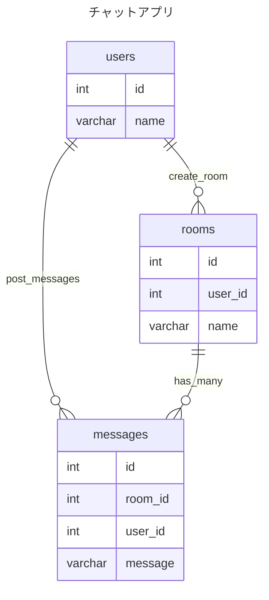

# ts-orm
TypeScript のいろんな ORM や QueryBuilder を試してみる

## test
```bash
$ docker compose up -d
$ npm run test
```

## code format
```bash
$ npm run fmt
```

## libs
### (TODO)Prisma
https://www.prisma.io/docs/getting-started

### (TODO)Mikro
https://mikro-orm.io/

### Kysely
https://kysely.dev/docs/getting-started

### (TODO)Sequelize
https://sequelize.org/docs/v6/

### (TODO)Orange
https://github.com/alfateam/orange-orm

### (TODO)TypeORM
https://typeorm.io/

## ER


